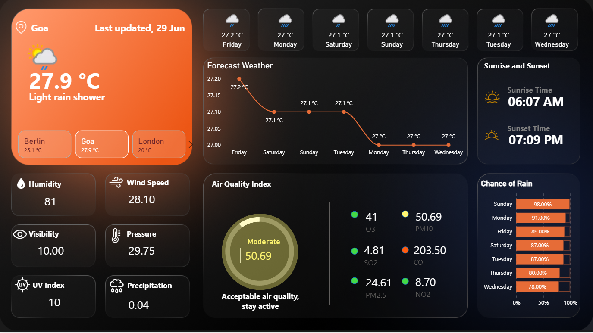

# 🌤️ Weather Dashboard — Power BI + API Integration

This project is a **real-time weather dashboard** built in Power BI using **API calls** to fetch current weather data. It displays key metrics like temperature, humidity, wind speed, and more, city-wise.

## 🔧 Tools & Tech
- Microsoft Power BI
- Weather API (OpenWeatherMap or similar)
- DAX for calculated columns
- Power Query for data transformation
- Real-time refresh capability

## 📊 Features
- Live weather updates via API
- City-wise comparison of conditions
- Cards, slicers, and interactive visuals
- Clean, modern UI optimized for dashboards
- Integrated fallback logic for null data

## 📷 Dashboard Preview

## 🗂 File Structure
- `weather_dashboard.pbix` → Power BI project file
- `weather_preview.png` → Dashboard screenshot

## 🚀 How It Works
- Weather data is fetched dynamically using **Power BI Web connector** with the weather API.
- Query is parameterized to fetch city-wise weather.
- Cleaned and structured using **Power Query** and **DAX**.

## 📌 Note
Ensure your API key is securely managed in the actual version used.

